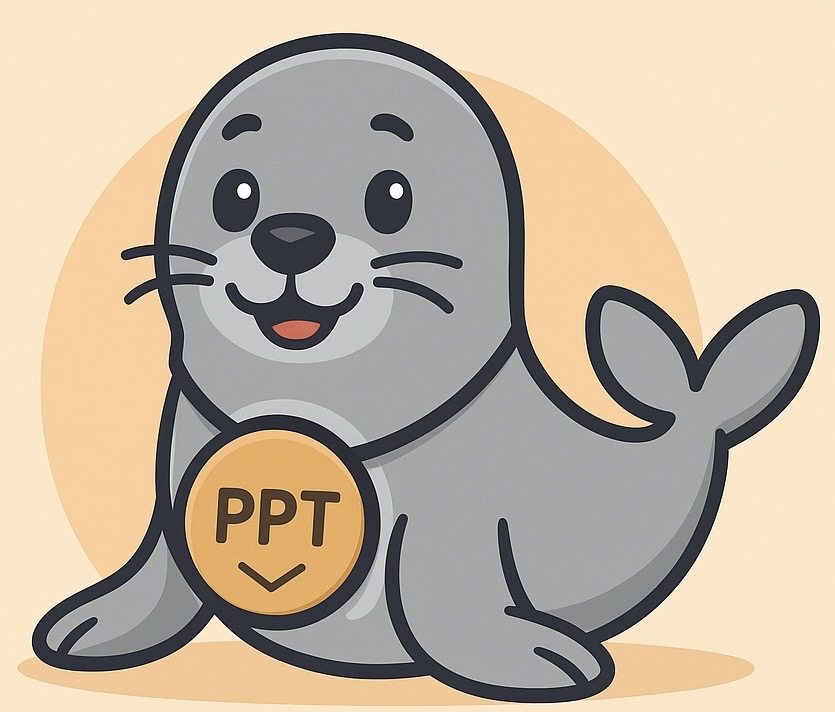

#  SafeSeal

---

## 🔒 Principle

SafeSeal is a small web service that helps distribute presentations or documents **while discouraging copy/paste or reuse**.  

- You upload a **PPTX, DOCX, or PDF** (PDFs are faster).  
- The app converts Office files to PDF, then **flattens pages into images**.  
- A **watermark with your name** is added across each page.  
- The result is a PDF that looks the same, but where **text cannot be copied or extracted** easily.  

This makes it easier to share teaching material or slides while keeping attribution clear and limiting uncontrolled reuse.

---

## 🌍 Try it online

The app is hosted on Render:  

---

## ⚙️ How it works (for the curious)

If you are interested in the technical side, here’s a short breakdown of how SafeSeal works:

1. **Hosting**  
   The site is deployed on [Render](https://render.com), a cloud platform that makes it easy to host web apps with Python.  
   Render runs the app in a Docker container, which allows us to install additional software like LibreOffice.

2. **Frontend (GUI)**  
   The interface is written in [Streamlit](https://streamlit.io).  
   Streamlit is a lightweight framework for building Python-based graphical web apps.  
   It handles file uploads, buttons, progress bars, and layout.

3. **Backend (Python)**  
   The core logic is implemented in Python using:  
   - **[PyMuPDF (fitz)](https://pymupdf.readthedocs.io/):** renders PDF pages into images and rebuilds watermarked PDFs.  
   - **[Pillow (PIL)](https://pillow.readthedocs.io/):** image processing and drawing watermarks.  
   - **subprocess + LibreOffice:** converts Office documents (PPTX, DOCX, XLSX…) into PDF in headless mode.  

4. **Why LibreOffice?**  
   Converting Office files directly in Python is not reliable. SafeSeal instead uses **LibreOffice in headless mode**, which Render lets us install inside a Docker image.  
   This guarantees consistent conversion results.  

5. **Pipeline summary**  
   - If the file is already a PDF → skip conversion.  
   - Else → run LibreOffice inside the container to get a PDF.  
   - Each page is rendered as an image, watermarked with the user’s name, then recombined into a new flattened PDF.  
   - The sealed file is offered for download.  

---

## 📦 Repository structure

- `app.py` — main Streamlit app.  
- `requirements.txt` — Python dependencies.  
- `Dockerfile` — enables LibreOffice inside the Render container.  
- `assets/` — icons and logos.  

---

## 💡 Why SafeSeal?

The goal is not **perfect DRM**, but **practical protection** for educators and professionals:  
- Attribution is visible (your name watermarked).  
- Copy/paste and text extraction are discouraged.  
- The visual fidelity of your slides is preserved.  

This helps you **share knowledge** while keeping your work traceable.